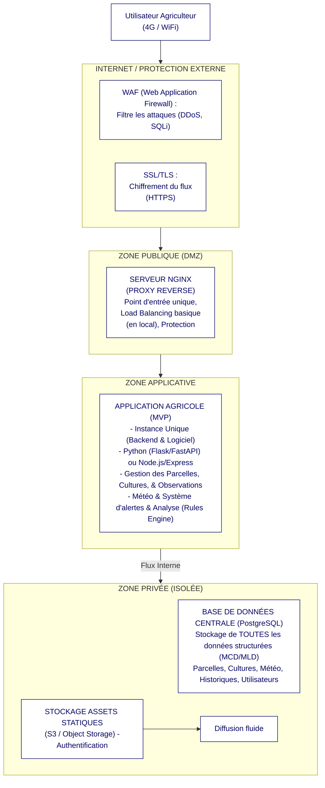

# AgroSuivi — Plateforme de suivi agricole

> Projet Bachelor 2 · Sup de Vinci · 2025-2026  
> Commanditaire simulé : Chambre d'Agriculture

## Présentation

AgroSuivi permet aux acteurs agricoles de :
- Surveiller l'état de leurs **parcelles** en temps réel
- Visualiser les **données météo** (température, humidité, précipitations)
- Saisir des **observations terrain**
- Recevoir des **alertes automatiques** basées sur des règles métier

## Stack technique

| Couche         | Technologie             |
|----------------|-------------------------|
| Frontend       | HTML5 / CSS3 / JavaScript |
| Backend        | Python 3 · Flask        |
| Base de données | SQLite                 |
| Graphiques     | Chart.js 4              |
| Infrastructure | Ubuntu 22.04 (VM)       |
| Déploiement    | VirtualBox + Nginx      |

## Installation locale

```bash
# 1. Cloner le projet
git clone https://github.com/TONCOMPTE/agri-dashboard.git
cd agri-dashboard

# 2. Installer les dépendances
cd backend
pip install -r requirements.txt

# 3. Initialiser la base de données (1 seule fois)
python init_db.py

# 4. Lancer le backend
python app.py
# → API sur http://localhost:5000

# 5. Ouvrir le frontend
# Ouvrir frontend/index.html dans un navigateur
```

## Règles métier — Alertes automatiques

| Condition météo                        | Type            | Niveau |
|----------------------------------------|-----------------|--------|
| Humidité > 90 % ET Température > 20 °C | Risque maladie  | 3      |
| Humidité > 80 % ET Température > 18 °C | Risque maladie  | 2      |
| Humidité > 70 % ET Température > 15 °C | Risque maladie  | 1      |
| Pluie > 25 mm                          | Excès eau       | 2      |
| Humidité < 35 % ET Pluie = 0           | Stress hydrique | 2      |
| Humidité < 45 % ET Pluie = 0           | Stress hydrique | 1      |

## Routes API

| Méthode | Route                      | Description                    |
|---------|----------------------------|--------------------------------|
| GET     | /api/parcelles             | Liste toutes les parcelles     |
| GET     | /api/parcelles/:id         | Détail d'une parcelle          |
| GET     | /api/meteo                 | Données météo (30 derniers j.) |
| GET     | /api/observations          | Toutes les observations        |
| POST    | /api/observations          | Ajouter une observation        |
| GET     | /api/alertes               | Toutes les alertes             |
| POST    | /api/alertes/analyser      | Générer alertes depuis météo   |
| GET     | /api/dashboard/stats       | Statistiques tableau de bord   |

## Équipe

| Membre       | Rôle                         |
|--------------|------------------------------|
| Prénom NOM   | Chef de projet · Backend     |
| Prénom NOM   | Base de données · Data       |
| Prénom NOM   | Frontend · UX                |
| Prénom NOM   | Infrastructure · Déploiement |

## Architecture

